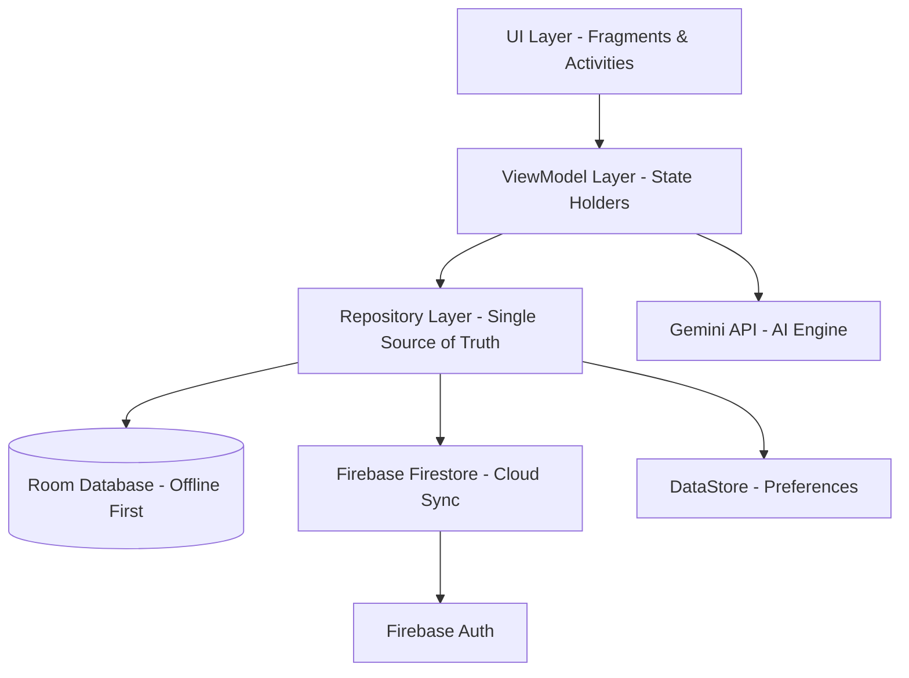
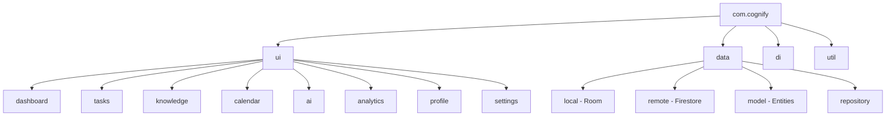

# Architecture Diagrams

## System Architecture

```mermaid
graph TD
    A[UI Layer - Fragments & Activities] --> B[ViewModel Layer - State Holders]
    B --> C[Repository Layer - Single Source of Truth]
    
    C --> D[(Room Database - Offline First)]
    C --> E[Firebase Firestore - Cloud Sync]
    C --> F[DataStore - Preferences]
    
    E --> G[Firebase Auth]
    
    B --> H[Gemini API - AI Engine]
```

## Package Structure

```mermaid
graph TD
    A[com.cognify] --> B[ui]
    A --> C[data]
    A --> D[di]
    A --> E[util]
    
    B --> B1[dashboard]
    B --> B2[tasks]
    B --> B3[knowledge]
    B --> B4[calendar]
    B --> B5[ai]
    B --> B6[analytics]
    B --> B7[profile]
    B --> B8[settings]
    
    C --> C1[local - Room]
    C --> C2[remote - Firestore]
    C --> C3[model - Entities]
    C --> C4[repository]
```
