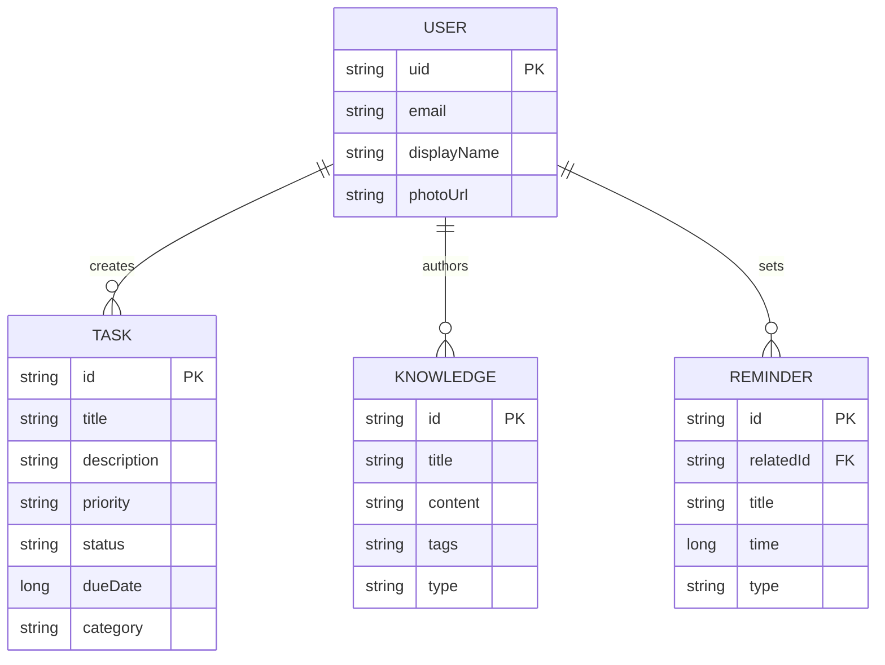

# Database & ER Diagrams

## Entity Relationship Diagram

```mermaid
erDiagram
    USER ||--o{ TASK : creates
    USER ||--o{ KNOWLEDGE : authors
    USER ||--o{ REMINDER : sets
    
    USER {
        string uid PK
        string email
        string displayName
        string photoUrl
    }
    
    TASK {
        string id PK
        string title
        string description
        string priority
        string status
        long dueDate
        string category
    }
    
    KNOWLEDGE {
        string id PK
        string title
        string content
        string tags
        string type
    }
    
    REMINDER {
        string id PK
        string relatedId FK
        string title
        long time
        string type
    }
```
