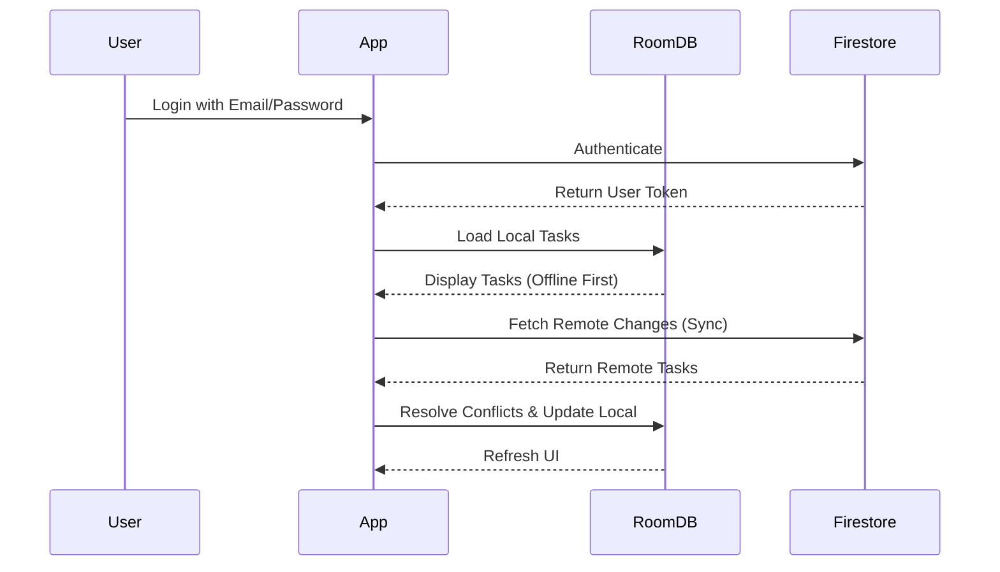
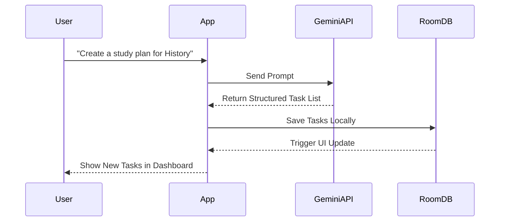

# Workflows

## User Authentication & Offline Sync Flow

```mermaid
sequenceDiagram
    participant User
    participant App
    participant RoomDB
    participant Firestore
    
    User->>App: Login with Email/Password
    App->>Firestore: Authenticate
    Firestore-->>App: Return User Token
    App->>RoomDB: Load Local Tasks
    RoomDB-->>App: Display Tasks (Offline First)
    
    App->>Firestore: Fetch Remote Changes (Sync)
    Firestore-->>App: Return Remote Tasks
    App->>RoomDB: Resolve Conflicts & Update Local
    RoomDB-->>App: Refresh UI
```

## AI Task Generation Flow

```mermaid
sequenceDiagram
    participant User
    participant App
    participant GeminiAPI
    participant RoomDB
    
    User->>App: "Create a study plan for History"
    App->>GeminiAPI: Send Prompt
    GeminiAPI-->>App: Return Structured Task List
    App->>RoomDB: Save Tasks Locally
    RoomDB-->>App: Trigger UI Update
    App-->>User: Show New Tasks in Dashboard
```
